# Offline Chat App 💬

A peer-to-peer messaging application that works completely offline using WebRTC. Connect with friends by scanning QR codes and chat directly without any servers or internet connection required!

## 📜 FlowChart

<div align="center">
  <br />
      
  <br />
</div>

## ✨ Features

- 🔄 **Completely Offline**: No servers, no internet required after initial setup
- 📱 **QR Code Connection**: Simply scan QR codes to connect with friends
- 💬 **Real-time Messaging**: Direct peer-to-peer communication via WebRTC
- 📦 **Message Queuing**: Messages are queued when offline and sent when reconnected
- 💾 **Persistent Storage**: All chats and contacts saved locally
- 🎨 **Modern UI**: Clean, responsive design with Tailwind CSS
- 📲 **PWA Ready**: Install as a native app on any device
- 🔒 **Privacy First**: All messages stay on your device

## 🚀 Getting Started

### Prerequisites

- Node.js (v16 or higher)
- A device with camera access (for QR scanning)

### Installation

1. **Clone the repository**

   ```bash
   git clone https://github.com/Rukhsarkh/GazaChat-PWA-Offline.git
   ```

2. **Install dependencies**

   ```bash
   npm install
   ```

3. **Start the development server**

   ```bash
   npm run dev
   ```

4. **Open in browser**
   Navigate to `http://localhost:5173` (or the port shown in terminal)

### Building for Production

```bash
npm run build
npm run preview
```

## 📁 Project Structure

```
offline-chat-app/
├── public/
│   ├── manifest.json          # PWA Manifest
│   └── icons/                 # App icons for different platforms
├── src/
│   ├── assets/                # Static images, logos
│   ├── components/
│   │   ├── ChatWindow.jsx     # UI for individual chat screen
│   │   ├── ContactCard.jsx    # Each contact in list
│   │   ├── ContactList.jsx    # List of connected contacts
│   │   ├── Header.jsx         # Top bar with QR and username
│   │   ├── QRGenerator.jsx    # Generates QR with offer/answer
│   │   ├── QRScanner.jsx      # Camera view to scan QR
│   │   ├── ConnectionStatus.jsx # Shows "Connected"/"Disconnected"
│   │   └── MessageInput.jsx   # Input + Send button
│   ├── hooks/
│   │   ├── usePeerConnection.js # Handles WebRTC setup, signaling
│   │   ├── useLocalStorage.js   # Persistent data (chats, user info)
│   │   └── useQueue.js          # Handles message queuing
│   ├── context/
│   │   └── AppContext.jsx     # Global state: user, contacts, messages
│   ├── pages/
│   │   ├── Home.jsx           # Contact list and QR code
│   │   └── Chat.jsx           # Chat screen per contact
│   ├── utils/
│   │   ├── webrtcUtils.js     # Helper for offer/answer
│   │   └── qrHelpers.js       # QR encoding/decoding
│   ├── App.jsx                # Main app with routes
│   ├── main.jsx               # Vite entry point
│   └── serviceWorker.js       # For offline support
├── package.json
├── tailwind.config.js         # Tailwind CSS configuration
└── vite.config.js            # Vite setup (includes PWA plugin)
```

## 🛠️ Tech Stack

| Layer             | Technology                   | Purpose                              |
| ----------------- | ---------------------------- | ------------------------------------ |
| **Frontend**      | React (Vite)                 | Fast PWA frontend                    |
| **Styling**       | Tailwind CSS                 | UI styling                           |
| **QR Generation** | `qrcode.react` / `qrcode`    | QR Code generation                   |
| **QR Scanning**   | `html5-qrcode` / `jsQR`      | QR Scanner (camera input)            |
| **Storage**       | `localStorage` / `IndexedDB` | Store chats, peer info, usernames    |
| **P2P**           | WebRTC (`RTCPeerConnection`) | Direct connection between devices    |
| **P2P Helper**    | `simple-peer` (optional)     | Easier WebRTC handling               |
| **PWA**           | Vite PWA Plugin              | Offline capability + Installable PWA |

## 🔧 Core Components

### Components Overview

| Component           | Responsibility                                          |
| ------------------- | ------------------------------------------------------- |
| `QRGenerator`       | Creates QR from offer/answer info (Base64 or JSON)      |
| `QRScanner`         | Uses camera to scan other user's QR and parse data      |
| `usePeerConnection` | Custom hook to manage offer, answer, ICE, DataChannel   |
| `ContactList`       | Shows all added contacts with "Connected" or not        |
| `ChatWindow`        | Chat UI + queued messages + restore from localStorage   |
| `ConnectionStatus`  | Top bar or badge showing online/offline status per peer |
| `useQueue`          | Holds unsent messages and retries on reconnect          |
| `AppContext`        | Stores app-wide state: username, peers, messages        |

### Key Features

#### 🔄 Connection Process

1. User A generates QR code with WebRTC offer
2. User B scans QR code and gets the offer
3. User B creates answer and shows QR code
4. User A scans User B's QR code to complete connection
5. Direct P2P connection established

#### 💾 Data Persistence

- All messages stored in `localStorage` or `IndexedDB`
- Contact information persisted locally
- Message queue survives app restarts
- No data leaves your device

#### 📱 PWA Features

- Installable on mobile and desktop
- Works offline after initial load
- Native app-like experience
- Background sync for queued messages

## 🎨 Bonus UI Features

- 👥 **Rename Contact**: Locally rename contacts for better organization
- ✨ **Typing Indicator**: See when someone is typing
- 🔐 **Local Password Lock**: Optional password protection
- 🎨 **Theme Toggle**: Dark/Light mode support

## 🚀 Usage

### Adding a Contact

1. **Generate Your QR Code**

   - Open the app and tap "Add Contact"
   - Your QR code will be displayed
   - Share this with the person you want to connect with

2. **Scan Their QR Code**

   - They scan your QR code with their app
   - They'll generate their own QR code
   - Scan their QR code to complete the connection

3. **Start Chatting**
   - Once connected, you can chat directly
   - Messages work offline and sync when reconnected

### Managing Connections

- **View Contacts**: See all your connections on the home screen
- **Connection Status**: Green dot = online, Gray dot = offline
- **Rename Contacts**: Long press to rename contacts locally
- **Delete Contacts**: Swipe to delete unwanted connections

## 🔒 Privacy & Security

- **No Servers**: All communication is peer-to-peer
- **Local Storage**: Messages never leave your device
- **No Tracking**: No analytics or user tracking
- **Open Source**: Full transparency of code
- **Optional Encryption**: End-to-end encryption for messages

## 🛠️ Development

### Available Scripts

```bash
npm run dev          # Start development server
npm run build        # Build for production
npm run preview      # Preview production build
npm run lint         # Run ESLint
npm run test         # Run tests
```

### Contributing

1. Fork the repository
2. Create a feature branch (`git checkout -b feature/amazing-feature`)
3. Commit your changes (`git commit -m 'Add amazing feature'`)
4. Push to the branch (`git push origin feature/amazing-feature`)
5. Open a Pull Request

## 🤝 Acknowledgments

- WebRTC community for excellent documentation
- QR code libraries for seamless scanning
- React and Vite teams for great developer experience
- Contributors who help improve this project

---

Made with ❤️ for Gaza

**Star this repo if you find it useful!** ⭐
